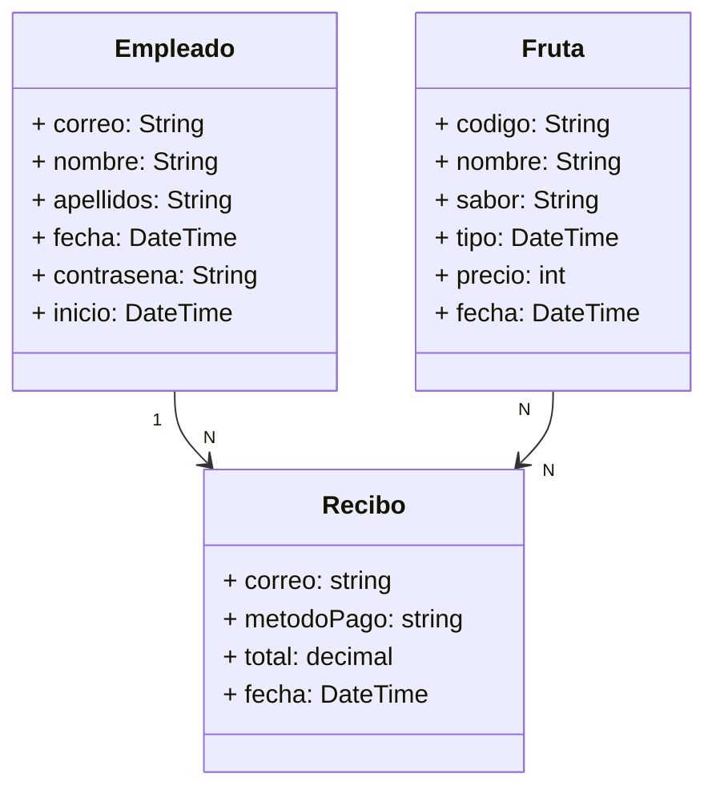

# Proyecto TPV_csharp

Este proyecto es una aplicación de escritorio desarrollada en C# con Windows Forms que simula la gestión de un TPV de frutas. La aplicación permite realizar diversas operaciones, como dar de alta y baja empleados, dar de alta y baja frutas, realizar ventas a través de un TPV (Terminal de Punto de Venta), y generar recibos.

## Contenido del Proyecto

### 1. **Clases:**

- `Empleado`: Representa a un empleado de la tienda con atributos como correo, contraseña, fecha de inicio, etc.
- `Fruta`: Representa una fruta en la tienda con atributos como código, nombre, tipo, sabor, precio, etc.
- `Recibo`: Representa un recibo generado por una venta con información como correo del cliente, método de pago, total y fecha de venta.

### 2. **Controladores:**

- Gestiona la lectura y escritura de datos relacionados con los empleados, frutas y recibos.

### 3. Relaciones UML:

### 4. **Vistas:**

- `Bienvenida`: Formulario para poder iniciar sesión
    
    
    
- `InicioSesion`: Formulario para iniciar sesion.
    
    
    

- `Tienda`: Menú principal que permite acceder a diferentes funcionalidades.
    
    
    

- `AltaEmpleado`: Formulario para dar de alta a un nuevo empleado.
    
    
    

- `BajaEmpleado`: Formulario para dar de baja a un empleado existente.
    
    
    

- `ListadoEmpleados`: Muestra la lista de empleados y sus fechas de inicio de sesión a modo de fichaje.
    
    
    

- `AltaFruta`: Formulario para dar de alta una nueva fruta.
    
    
    

- `BajaFruta`: Formulario para dar de baja una fruta existente.
    
    
    

- `ListadoFruta`: Muestra la lista de frutas en stock.
    
    
    

- `TPV`: Terminal de Punto de Venta para realizar ventas.
    
    
    

- `FiltroRecibos`: Permite filtrar y mostrar recibos según el mes de venta.
    
    
    

- `ModificarFruta`: Permite modificar el precio de una fruta seleccionada.
    
    
    

- `ModificarPrecio`: Permite modificar el precio de una fruta específica.
    
    
    

## Funcionalidades Principales

### Gestión de Empleados

- **AltaEmpleado:** Permite registrar a un nuevo empleado con su correo electrónico y contraseña.
- **BajaEmpleado:** Permite dar de baja a un empleado existente.

### Gestión de Frutas

- **AltaFruta:** Permite añadir una nueva fruta al inventario.
- **BajaFruta:** Permite dar de baja una fruta existente en el inventario.
- **ModificarFruta:** Permite modificar el precio de una fruta existente.

### Terminal de Punto de Venta (TPV)

- **Selección de Frutas:** Permite seleccionar las frutas que el cliente desea comprar.
- **Selección de Método de Pago:** Permite seleccionar entre efectivo o tarjeta como método de pago.
- **Cálculo del Precio Total:** Calcula el precio total de la compra.
- **Generación de Recibo:** Genera un recibo con la información de la compra.

### Generación de Recibos

- **Filtro por Mes:** Permite filtrar y mostrar recibos según el mes de la venta.

## Uso de la Aplicación

1. **Inicio de Sesión:**
    - Abre la aplicación e inicia sesión con un correo electrónico y contraseña válidos. Está el correo admin1@platanitos.com registrado por defecto con contraseña 1234.
2. **Menú Principal:**
    - Desde el menú principal, accede a las diferentes funcionalidades según tus necesidades.
3. **Gestión de Empleados:**
    - Da de alta o baja a empleados según sea necesario.
4. **Gestión de Frutas:**
    - Añade nuevas frutas al inventario o da de baja frutas existentes.
5. **Terminal de Punto de Venta (TPV):**
    - Selecciona las frutas que el cliente desea comprar, elige el método de pago y finaliza la venta.
6. **Generación de Recibos:**
    - Filtra y visualiza los recibos generados según el mes de venta.

## **Conclusiones:**

El proyecto ha logrado crear una aplicación funcional que permite a los empleados de una frutería gestionar la información de frutas y empleados. La implementación de lectura y escritura en ficheros proporciona persistencia de datos. La interfaz de usuario es clara y fácil de entender. Sin embargo, se sugiere mejorar la validación de datos y explorar opciones para mejorar la interfaz de usuario, como el uso de patrones de diseño.

En resumen, el proyecto es un buen punto de partida para expandir y mejorar las capacidades de la aplicación en el futuro.

## Contribuciones

Las contribuciones son bienvenidas. Si deseas mejorar o agregar nuevas características a la aplicación, sigue estos pasos:

1. Realiza un `fork` del repositorio.
2. Crea una nueva rama (`branch`) para tu función o corrección de bugs.
3. Realiza los cambios y haz `commit`.
4. Realiza un `push` a tu rama.
5. Crea un nuevo `pull request`.

## Autor

Desarrollado por Lucía Marchal.
